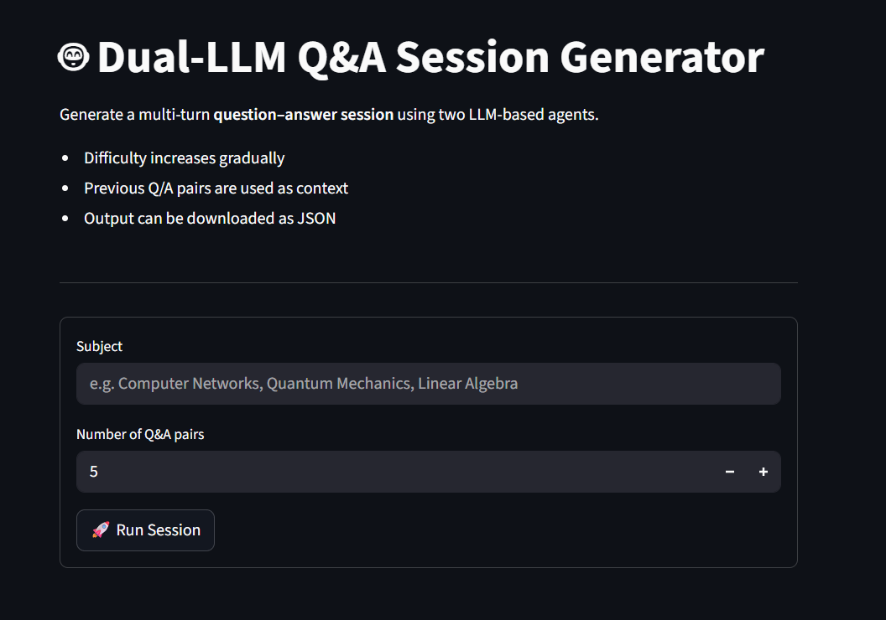
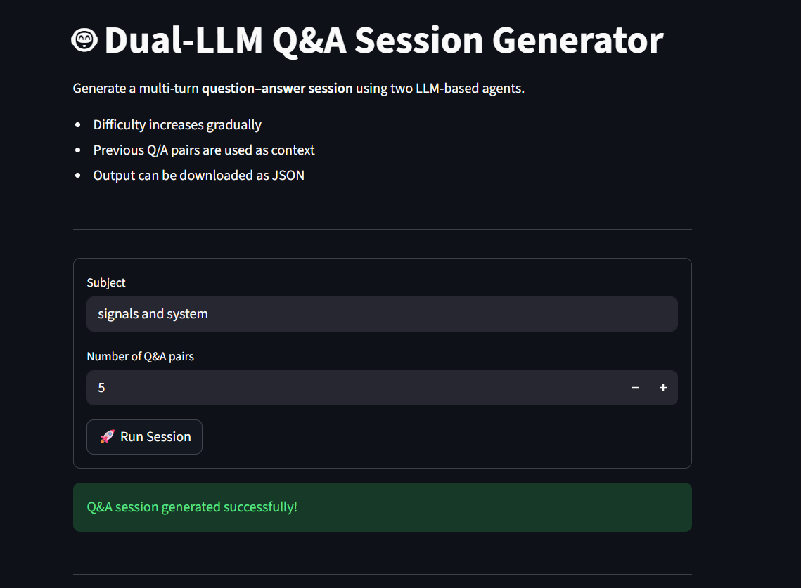
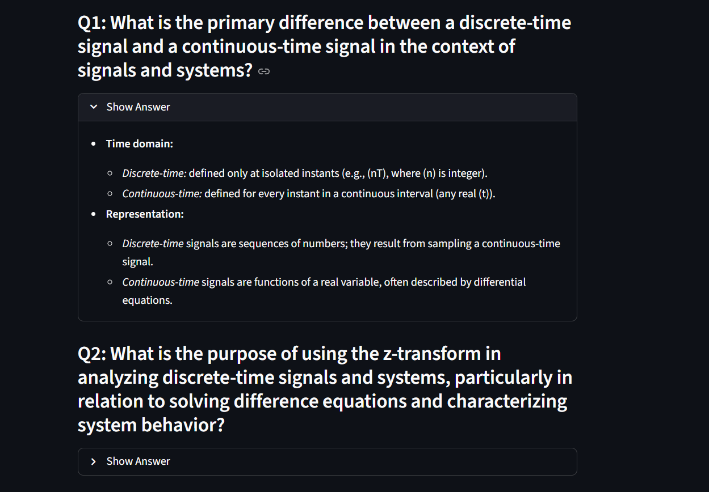

# Dual-LLM Q&A Session Application

This project implements a small web service that orchestrates **two LLM-based agents** to generate a multi-turn **question–answer session** on a given subject.

The backend is built using **FastAPI** and **Pydantic**, and the frontend uses **Streamlit** for a simple interactive interface.

## System Overview

The application consists of **two logical LLM agents**:

### Question-Agent

- Generates **exactly one clear and unambiguous question** per turn
- Difficulty increases gradually from *easy → medium → hard*
- May use previous question–answer pairs as context
- Explicitly constrained to avoid multi-part questions

**LLM used:**

Meta LLaMA (`llama-3.3-70b-versatile`) via Groq

---

### Answer-Agent

- Produces **concise, high-coverage answers**
- Uses previous context only when it improves correctness
- Output verbosity is strictly controlled (minimal points, maximum coverage)

**LLM used:**

OpenAI GPT-OSS-120B (open-weight) via Groq

---

The separation into two agents reflects **distinct reasoning roles** and keeps the interaction logic explicit and easy to understand.

---

## Core Logic

For a given subject and number of question–answer pairs, the system performs the following steps:

1. Compute the difficulty level for the current iteration.
2. Generate a question using the Question-Agent.
3. Generate an answer using the Answer-Agent.
4. Store the `(question, answer)` pair as conversational memory.
5. Repeat until the required number of pairs is generated.
6. Return the final output as a JSON response and save it locally as a JSON file.

---

## Project Structure

```
dual_llm/
│
├── app/
│   ├── main.py# FastAPI app, API endpoint, orchestration logic
│   ├── agents.py# Question-Agent and Answer-Agent
│   ├── schemas.py# Pydantic request/response models
│
├── frontend/
│   └── frontend.py# Streamlit frontend
│
├── outputs/# Saved Q&A sessions as JSON files
│
├── .env# Environment variables (API keys)
├── pyproject.toml# Dependencies managed using uv
└── README.md
```

Each module has a **single responsibility**, keeping the codebase clean and maintainable.

---

## Running the Project Locally

### Prerequisites

- Python 3.10+
- `uv` package manager
- A valid **Groq API key**

---

### Environment Setup

Create a `.env` file in the project root:

```
GROQ_API_KEY=your_groq_api_key_here
```

---

### Install Dependencies

From the project root:

```bash
uvsync
```

---

### Run the Backend (FastAPI)

```bash
uv run uvicorn app.main:app --reload
```

The API will be available at:

```
http://localhost:8000
```

---

### Run the Frontend (Streamlit)

In a new terminal:

```bash
uv run streamlit run frontend/frontend.py
```

The Streamlit UI will open automatically in your browser.

### Screen Shots

Here are few screenshots featuring the working project 


